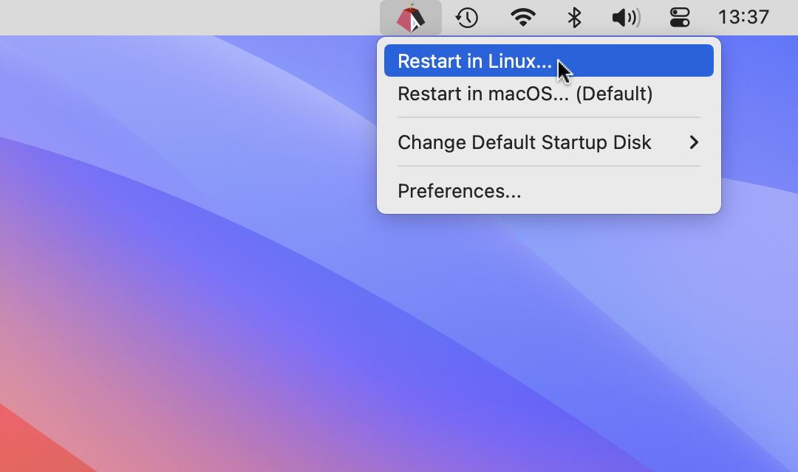
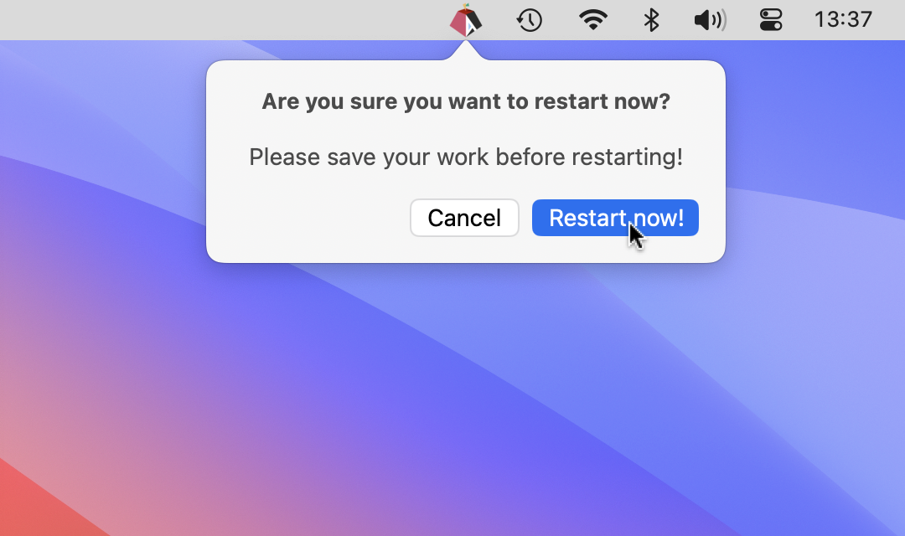
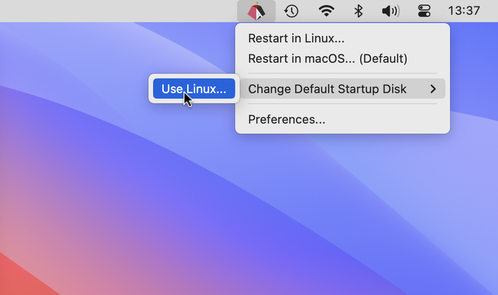

```diff
- NOTE:
- Once we've decided on the best compromise for
```
[(the Linux version UI)](https://github.com/rxhfcy/Asahi-Restart-Helper--Linux-version)
```diff
- AND if "Option Y" (this version) is not chosen,
- the macOS version will be updated to match the UI of the Linux version.
```

---

# Asahi Startup Disk Icon<br>("Restart in Linux")

<br>

**Asahi Startup Disk Icon** makes it easy to
restart your Apple silicon Mac into [Asahi Linux](https://asahilinux.org/) (from macOS).

**NOTE: You should also install the
[corresponding Linux version ("Restart in macOS")](https://github.com/rxhfcy/Asahi-Restart-Helper--Linux-version),<br>
to make it equally easy to return back to macOS from Linux!**

## Usage

Click the app's menubar icon to access the menu:

- **Restart in Linux**: This sets **Linux** as the default 'Startup Disk' and restarts the computer (in Linux).<br>

- (if multiple "Linux" disks are detected, they will be listed in the menu by their respective disk names)

- **Change default 'Startup Disk'**: Use this option to change the default 'Startup Disk' without restarting.
  For example, switch the default back to macOS.
- **Preferences**: This allows you to set the application to always display its menubar icon after login.
  You can also enable password-free usage by installing a privileged helper tool.

The 'Startup Disk' determines the operating system that your computer will load by default
after a shutdown or a "normal" restart.

## Features

- **Fast and Easy to Use**: Just click the icon and then "Restart in Linux".
- **Changes 'Startup Disk' Setting**: Restarting in Linux changes the default 'Startup Disk' setting -> Linux,
  to make shutting down and restarting "normally" always return back to the same OS.
- **Same GUI on Both macOS and Linux**: Use the same GUI on both operating systems by
  also installing the corresponding
  [Linux version ("Restart in macOS")](https://github.com/rxhfcy/Asahi-Restart-Helper--Linux-version) on Linux.

## Who should use this and why?

Both beginners and expert users will hopefully find this application beneficial.
It simplifies the process of dual-booting Linux and macOS on Apple Silicon Macs.

Apple's native boot menu is hidden on start-up, making it unnecessarily hard to access and slow to use.
This application works around the "missing" boot menu and makes switching to "the other OS"
more convenient and accessible.

## Screenshots:

<br>

```diff
- TODO: update screenshot to
- remove the "Restart in macOS" stuff from an earlier UI iteration
```

1\. Click "Restart in Linux..." from the menu to restart in Linux next.<br>
(i.e. restart in Linux this time only without changing the default Startup Disk!)

---

<br>

```diff
- TODO: update screenshot to
- explicitly state that "name of Linux disk" will be used as the default 'Startup Disk'
```

2\. Then click "Restart now!" from the Restart dialog.
The system will restart without asking any further questions (if the correct permissions etc are set).

---

<br>

```diff
- TODO: update submenu in screenshot to
- also show the current default Startup Disk as disabled + "(current default)"

- TODO: update screenshot to
- remove the "Restart in macOS" stuff from an earlier UI iteration
```

The app can also be used to change the default Startup Disk directly from the menu<br>

---

## Build the App with Xcode:

1. Clone this repository:<br>
   `git clone https://github.com/rxhfcy/Asahi-Restart-Helper--macOS-version.git`<br>
   or download the
   [zip file](https://github.com/rxhfcy/Asahi-Restart-Helper--macOS-version/archive/refs/heads/main.zip)
   and extract it
3. Launch Xcode, choose "Open Existing Project..."
4. Navigate to the new folder (Xcode will automatically look for and open the `.xcodeproj` bundle)
5. You should now be able to build and test the project (please open a new issue if that was not the case!)

## Download initial demo version:

**TODO: update demo app UI and name**

Download:  
[Asahi Linux Helper.app.zip](./misc/Asahi%20Linux%20Helper.app.zip)

- Self-signed
- UI demo only
- Doesn't actually restart yet
- Doesn't actually change default 'Startup Disk' yet

## Technical overview

Because Apple decided to not allow showing the boot menu on start-up,
they also had to introduce the somewhat confusingly named concept of the 'Startup Disk',
which determines the default OS that is always loaded after shutting down the computer or restarting it "normally".

This application provides a GUI that makes it easy to switch to the other OS,
by running the Apple's `bless` command line tool and then restarting.
Using `bless` without `--nextonly` changes the default 'Startup Disk' setting (the `boot-volume` NVRAM parameter).

When exactly two bootable disks are detected, the "other" disk is assumed to be the "Linux" disk.
If three or more disks are detected, any "other" disks are listed in the menu using their full disk names.

NOTE: macOS does not permit apps to directly use the standard macOS Restart dialog,
so a custom restart dialog must be used.
However, the custom restart appears to respect any previously selected "Reopen windows when logging back in" setting
from the aforementioned system restart dialog **(TODO: test and verify this)**.

## Requirements

- Apple silicon Mac (Asahi Linux is ARM64-only)
- Both Asahi Linux and macOS must be installed on the computer

## Contributing

Contributions are welcome! Please open a new issue or pull request.

## License

This project is licensed under the [MIT License](./LICENSE).

## Project goals

The ultimate goal of this project is to have the icon installed by default (both on Linux and macOS)
automatically when the official [Asahi Linux installer](https://asahilinux.org) is used.

- **Linux System Tray icon**: The goal is to convince Fedora Asahi Remix
  to automatically install the Linux version of this application (add the icon in Linux/KDE System Tray)
  - "asahi-bless daemon" required first (todo (Rust))
  - Bonus: also install a GNOME extension that allows showing the System Tray icon
   on GNOME?
- **macOS menubar icon**: The goal is to also convince the Asahi Linux installer to automatically install
  the macOS version of this application (add the icon in macOS menubar)
- **Rationale**: This would benefit all users, especially beginners who e.g. don't already know the
  correct "arcane spell" to switch to macOS from Linux (`sudo dnf install asahi-bless && sudo asahi-bless`)

# See also: [TODO.md](./Asahi%20Restart%20Helper/TODO.md)
